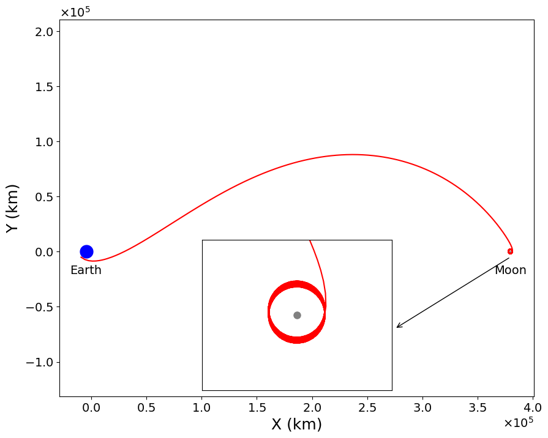

# TrajectoryOptimizer

A numerical optimiser that searches a four-dimensional parameter space for the
lowest-fuel rocket trajectory from Earth orbit to Moon orbit.

Built as a final-year computing project. The full write-up, including the derivations
and error analysis, is in [`Report/`](Report/Minimum_Fuel_Transfer_Trajectory_Between_Earth_and_Moon_in_the_Circular_Restricted_3_Body_Problem.pdf).

**Stack:** Python 3.11 · NumPy · SciPy · pandas · matplotlib · Jupyter · uv



## Problem Definition

Getting to the Moon cheaply is an optimisation problem. Fuel cost is measured in **Δv**
(delta-v, the total change in velocity a spacecraft must produce), and because the rocket
equation is exponential, roughly 90% of a rocket's launch mass is propellant, so small
Δv savings translate into large mass and cost savings.

The transfer uses two engine burns: one to leave a 167 km circular Earth orbit, and one to
enter a 100 km circular Moon orbit. The optimiser searches for the four numbers that make
this as cheap as possible:

| Variable | Meaning |
|---|---|
| `θ` | where on the Earth orbit the spacecraft departs from |
| `Δv₁` | how hard the first burn fires |
| `α` | which direction the first burn points |
| `T` | how long the coast to the Moon lasts |

The benchmark to beat is the **Hohmann transfer** (the classical two-body solution used by
the Apollo missions) which costs **3.954 km/s**.

## Method

- **Posed as a constrained non-linear program:** minimise `Δv₁ + Δv₂` subject to a terminal position constraint (the spacecraft must actually arrive in a stable lunar orbit). The second burn `Δv₂` is *derived* from the arrival state rather than searched, which drops the search space from five dimensions to four.
- **Hierarchical grid search** (4 levels, 20 points per variable, shrink factor 0.5). Each level re-centres and narrows the bounds around the most feasible point found by the level above. The constraint is optimised before the objective, so the search never chases a cheap trajectory that doesn't physically arrive.
- **Integration with SciPy's DOP853**, an 8th-order adaptive Runge–Kutta method, at `rtol = atol = 1e-12`. The equations of motion are solved in non-dimensional units so every state variable is O(1) and the solver's error control applies uniformly across all of them.
- **160,000 trajectory simulations per level**; ~20 hours total runtime.

## Results

> **Δv_total = 3.958 km/s** — 0.09% higher the 3.954 km/s Hohmann benchmark.
> The optimiser converged on a valid transfer, but not a cheaper one.

Optimal parameters, with the range over which Δv_total stays within 5% of the optimum:

| Variable | Value |
|---|---|
| `θ` | 3.9844 <sup>+0.0002</sup><sub>−0.0020</sub> rad |
| `Δv₁` | 3.1002 <sup>+0.0002</sup><sub>−0.0002</sub> km/s |
| `α` | 0.1046 <sup>+0.0003</sup><sub>−0.0003</sub> rad |
| `T` | 5.366 <sup>+0.003</sup><sub>−0.009</sub> days |

## Discussion

- **Integrator correctness.** The Jacobi integral is a quantity the true dynamics conserve exactly, so any drift in it is pure numerical error. Measured drift was σ = 4.9 × 10⁻¹², matching the solver's own 1e-12 tolerance — integration error is negligible relative to the result.
- **Uncertainty quantification.** 400,000 Monte Carlo samples drawn uniformly from the final grid cell were used to map the feasible region and derive the sensitivity bounds above, at the 5% margin standard used by the European Space Agency.

## Analysis

1. **The flight-time bound was too short.** The search covered 2.5–7.5 days. Transfers that genuinely exploit three-body dynamics need `T ≈ 255` days — Topputo reaches 3.894 km/s out there. The cheap solutions were never inside the search box.
2. **The algorithm's complexity was the binding constraint, not the physics.** The search is O(L·N⁴). Extending `T` by two orders of magnitude would mean roughly 2,000 hours of compute.
3. **The refinement is greedy on a fractal landscape.** The phase space has structure at every scale, and discarding all but the best point at each level means a finite grid can converge to a local optimum — which is what happened here.

Seed a gradient-based NLP solver (e.g. SNOPT, as used in NASA's GMAT) with this solution as an initial guess, and search a far wider range of `T` at much lower cost per evaluation.

## Package layout

| Module | Contents |
|---|---|
| `cr3bp/system.py` | `CR3BPSystem`, `create_earth_moon_system()` |
| `cr3bp/dynamics.py` | equations of motion, `solve_CR3BP` (DOP853), orbit-state constructors |
| `cr3bp/objective.py` | objective and constraint functions |
| `cr3bp/grid_search.py` | the hierarchical search |
| `cr3bp/conversions.py` | rotating↔inertial frames, dimensional↔non-dimensional scaling |
| `cr3bp/plotting.py`, `cr3bp/visualization.py` | static plots and MP4/GIF animation |

## Setup

Requires [uv](https://docs.astral.sh/uv/).

```bash
uv sync
```

This creates a virtual environment with the pinned Python 3.11 and installs
`cr3bp` in editable mode.

## Running the notebooks

```bash
uv run jupyter lab
```

Open `notebooks/main.ipynb` (grid search) or `notebooks/results_viewer.ipynb`
(trajectory plots and animation).

> Animation export to `.mp4` requires `ffmpeg` on your PATH
> (`cr3bp/visualization.py` falls back to the `pillow` writer for `.gif`).
